# 🚀 Blog Upload & Migration Pipeline Skill (Pure CMS MCP)

> **Operational Directive:**  
> This skill defines the industrial-grade, forensic blog migration and publishing pipeline for the **Jupsoft Centralized Multi-Site Blog Platform (Blogary)**.  
> It governs how articles are extracted from existing websites (e.g. `jupsoft.com/blog/`), structurally remediated, authentically backdated, and published through the **FastMCP CMS Server** (Port `7367`) without direct database tampering, ensuring 100% data integrity, zero downtime, and seamless cross-domain parity.

---

## 📑 Table of Contents
1. [End-to-End Pipeline Architecture](#1-end-to-end-pipeline-architecture)
2. [Stage 1: Forensic Source Extraction & Card Telemetry](#stage-1-forensic-source-extraction--card-telemetry)
3. [Stage 2: Content Remediation & Structural Sanitization](#stage-2-content-remediation--structural-sanitization)
4. [Stage 3: Authentic Backdating & Historical Timestamp Locking](#stage-3-authentic-backdating--historical-timestamp-locking)
5. [Stage 4: Pure CMS MCP 5-Step Editorial Lifecycle](#stage-4-pure-cms-mcp-5-step-editorial-lifecycle)
6. [Stage 5: 301 Redirects & Unicode Slug Parity](#stage-5-301-redirects--unicode-slug-parity)
7. [Stage 6: Dual-Layer Cache Invalidation (Redis & Edge)](#stage-6-dual-layer-cache-invalidation-redis--edge)
8. [Stage 7: Grid Balancing (Limit 9 ➔ 10 Override)](#stage-7-grid-balancing-limit-9--10-override)
9. [Stage 8: Cross-Domain Parity (`test1.jupsoft.in` ➔ `jupsoft.com`)](#stage-8-cross-domain-parity-test1jupsoftin--jupsoftcom)
10. [Troubleshooting & Quality Assurance Checklist](#10-troubleshooting--quality-assurance-checklist)

---

## 1. End-to-End Pipeline Architecture

```mermaid
flowchart TD
    A["Source Website<br>(jupsoft.com/blog/)"] -->|"1. Cheerio/Puppeteer Scraping"| B["Raw Article Extraction<br>Cards, Dates, Images, HTML Body"]
    B -->|"2. Remediation Rules"| C["Clean Structured Content<br>Sanitize HTML, Fix Links, Format Headings"]
    C -->|"3. Timestamp Extraction"| D["Authentic Historical Backdates<br>Exact Date Sync from Original Cards"]
    D -->|"4. FastMCP SSE Engine (Port 7367)"| E{"Pure CMS MCP Lifecycle"}
    E -->|"Step 4.1"| F["cms_create_blog<br>(Status: Draft)"]
    F -->|"Step 4.2"| G["cms_upsert_translation<br>(Exact Slug & SEO Metadata)"]
    G -->|"Step 4.3"| H["cms_submit_blog_for_review<br>(Status: Under Review)"]
    H -->|"Step 4.4"| I["cms_approve_blog<br>(Status: Approved)"]
    I -->|"Step 4.5"| J["cms_publish_blog<br>(Status: Published)"]
    J -->|"5. Unicode Parity"| K["cms_create_redirect<br>(301 En-dash to ASCII Slug)"]
    K -->|"6. Redis Invalidation"| L["Redis & CloudFront Touch<br>(Evict Cached List Keys)"]
    L -->|"7. Backend Override"| M["Limit 9 ➔ 10 Grid Auto-Balance<br>(5 Rows x 2 Cols)"]
    M -->|"8. Zero-Friction Domain Parity"| N["Dual-Domain Support<br>(test1.jupsoft.in & jupsoft.com)"]
```



---

## Stage 1: Forensic Source Extraction & Card Telemetry

Before creating any article, thoroughly scrape and extract the complete metadata directly from the source portal:

### Required Source Fields:
| Field | Source Location | Description |
| :--- | :--- | :--- |
| **Title** | Card `h2` / Page `h1` | Exact article title |
| **Original Slug** | Card `a[href]` | Relative or absolute path (e.g. `/blog/slug-name`) |
| **Card Date** | Card `li i.bx-calendar-alt` | Exact publication date as rendered on the public card |
| **Category** | Card `h4` / Breadcrumb | Primary category name (e.g. `School ERP`, `Technology`) |
| **Author Name** | Card `li i.bx-user` | Author name (strip internal role tags like `(author)` or `(superadmin)`) |
| **Featured Image** | Card `img[src]` | High-res hero cover image URL |
| **HTML Content** | `.blog-content-body` | Complete structured article HTML (paragraphs, headings, lists, tables) |

### Node.js Scraping Implementation Pattern:
```javascript
const cheerio = require('cheerio');

async function extractSourceArticle(url) {
  const res = await fetch(url, { headers: { 'User-Agent': 'Mozilla/5.0 (Windows NT 10.0; Win64; x64)' } });
  const html = await res.text();
  const $ = cheerio.load(html);

  const title = $('h1').first().text().trim();
  const rawDate = $('.post-date, .bx-calendar-alt').first().parent().text().trim();
  const heroImage = $('.featured-img img, .post-thumbnail img').attr('src') || '';
  
  // Extract and isolate core content container
  const contentContainer = $('.blog-details-content, .entry-content, .article-body').first();
  // Strip extraneous widgets, ads, social shares, or script tags
  contentContainer.find('script, style, .social-share, .newsletter-box').remove();
  const bodyHtml = contentContainer.html() || '';

  return { title, rawDate, heroImage, bodyHtml };
}
```

---

## Stage 2: Content Remediation & Structural Sanitization

Source content often contains artifacts, broken CTA buttons, unlinked raw URLs, or formatting defects that degrade readability. Apply the following automated remediation passes:

1. **Remove Broken / Redundant Injected CTA Blocks:**
   - Remove hardcoded form containers, empty CTA boxes, or third-party tracking embeds.
2. **Convert Plain-Text URLs to Clickable Links:**
   - Detect plain text `https://...` inside paragraphs and wrap them in `<a href="..." target="_blank" rel="noopener noreferrer">...</a>`.
3. **Clean Author Names:**
   - Strip internal system badges:
     ```javascript
     function cleanAuthorName(name) {
       if (!name) return 'Jupsoft Team';
       return name.replace(/\s*\([^)]*(?:admin|editor|author|superadmin|user)[^)]*\)/gi, '').trim() || 'Jupsoft Team';
     }
     ```
4. **Header Normalization:**
   - Ensure a clean hierarchical structure (`h2`, `h3`, `h4`).
   - Eliminate duplicated titles inside the body that repeat the main `h1`.

---

## Stage 3: Authentic Backdating & Historical Timestamp Locking

Articles must maintain authentic search engine authority and chronological order matching the original site.

### Date Conversion Protocol:
1. Parse the extracted card date string (e.g. `"Jul 30, 2026"`, `"18 Oct 2025"`, `"September 18, 2023"`).
2. Convert into UTC ISO-8601 string: `YYYY-MM-DDTHH:mm:ss.sssZ` (e.g. `2026-07-30T10:00:00.000Z`).
3. Set the time component to `10:00:00Z` (standard morning release hour) to prevent timezone shifts across IST/UTC.
4. Pass this timestamp into the publication lifecycle so `publishDate` is stored identically in PostgreSQL and returned via `/v1/blogs`.

---

## Stage 4: Pure CMS MCP 5-Step Editorial Lifecycle

All content creation and publication **MUST** pass through the **Jupsoft FastMCP Server** on port `7367`.  
*(Direct SQL/Supabase insertions bypass validation guards, activity logs, and caching webhooks).*

```
┌─────────────────┐     ┌────────────────────────┐     ┌───────────────────────────────┐
│ cms_create_blog │ ──> │ cms_upsert_translation │ ──> │ cms_submit_blog_for_review   │
└─────────────────┘     └────────────────────────┘     └───────────────────────────────┘
                                                                       │
                                                                       ▼
┌──────────────────┐                                   ┌───────────────────────────────┐
│ cms_publish_blog │ <──────────────────────────────── │ cms_approve_blog              │
└──────────────────┘                                   └───────────────────────────────┘
```

### Complete Implementation Script:
```javascript
const MCP_BASE = 'http://127.0.0.1:7367';

async function callMcp(toolName, payload) {
  const res = await fetch(`${MCP_BASE}/${toolName}`, {
    method: 'POST',
    headers: { 'Content-Type': 'application/json' },
    body: JSON.stringify(payload)
  });
  const data = await res.json();
  if (!data.success && data.status >= 400) {
    throw new Error(`MCP Tool ${toolName} failed: ${JSON.stringify(data)}`);
  }
  return data.data;
}

async function publishArticlePipeline({
  websiteId,
  categoryId,
  title,
  slug,
  contentHtml,
  excerpt,
  featuredImage,
  authorName,
  publishDateIso
}) {
  // Step 4.1: Create Blog in Draft State
  const blog = await callMcp('cms_create_blog', {
    website_id: websiteId,
    title: title,
    category_id: categoryId,
    featured_image: featuredImage,
    author_name: authorName || 'Jupsoft Team',
    read_time_minutes: 5,
    publish_date: publishDateIso
  });
  const blogId = blog.id;

  // Step 4.2: Lock Exact Translation Slug & Rich Content
  await callMcp('cms_upsert_translation', {
    blog_id: blogId,
    lang: 'en',
    title: title,
    slug: slug,
    content: contentHtml,
    excerpt: excerpt,
    meta_title: `${title} | Jupsoft`,
    meta_description: excerpt.slice(0, 160),
    canonical_url: `https://jupsoft.com/blog/${slug}`,
    robots: 'index, follow'
  });

  // Step 4.3: Submit Draft for Review
  await callMcp('cms_submit_blog_for_review', {
    blog_id: blogId,
    notes: 'Submitted via Autonomous Blog Upload Pipeline'
  });

  // Step 4.4: Editorial Approval
  await callMcp('cms_approve_blog', {
    blog_id: blogId,
    notes: 'Approved via Autonomous Blog Upload Pipeline'
  });

  // Step 4.5: Publish Article & Seal Authentic Backdate
  await callMcp('cms_publish_blog', {
    blog_id: blogId,
    publish_date: publishDateIso
  });

  return { success: true, blogId, slug, status: 'Published' };
}
```

---

## Stage 5: 301 Redirects & Unicode Slug Parity

### The Unicode En-Dash Issue:
Some legacy CMS URLs contain Unicode en-dashes (`–`, `U+2013`) instead of standard ASCII hyphens (`-`, `U+002D`).  
*Example:* `learning-management-software-buying-guide-for-schools-in-2026–27`

**Handling Rule:**
1. Save the canonical slug using standard ASCII hyphen:  
   `learning-management-software-buying-guide-for-schools-in-2026-27`
2. Create a permanent 301 redirect from the Unicode URL to the ASCII URL via `cms_create_redirect`:
   ```javascript
   await callMcp('cms_create_redirect', {
     website_id: websiteId,
     source_path: 'blog/learning-management-software-buying-guide-for-schools-in-2026–27',
     target_url: '/blog/learning-management-software-buying-guide-for-schools-in-2026-27',
     status_code: 301
   });
   ```

---

## Stage 6: Dual-Layer Cache Invalidation (Redis & Edge)

The public API (`/v1/blogs`) employs high-performance caching (300s in Redis). After any bulk upload or backdating:

1. **Touch Invalidation via MCP:**
   Call `cms_update_blog` with a harmless property touch, triggering the backend's internal cache evictor.
2. **Direct Invalidation Endpoint:**
   POST to `/v1/revalidate` with `x-signature` or SuperAdmin credentials:
   ```bash
   curl -X POST "https://blogary.jupsoft.com/v1/revalidate?website=site-jupsoft-test" \
        -H "Content-Type: application/json" \
        -d '{"event": "blog.published", "slug": "all"}'
   ```
3. **Bypass Cache during Verification:**
   Append `&fresh=1` or `Cache-Control: no-cache` to test endpoints to inspect live PostgreSQL data immediately.

---

## Stage 7: Grid Balancing (Limit 9 ➔ 10 Override)

### The UI Problem:
A 2-column card grid requested with `limit=9` leaves row 5 with 1 card on the left and an empty white space on the right, looking incomplete.

### The Backend Solution:
Rather than requesting frontend refactors across every consumer portal, the NestJS backend dynamically normalizes `limit=9` to `10`:

```typescript
// backend/src/modules/public-v1/public-v1.service.ts
const rawLimit = Number(params.limit);
const effectiveLimit = rawLimit === 9 ? 10 : (rawLimit || 10);
const safeLimit = Math.max(1, Math.min(effectiveLimit, 50));
const skip = (safePage - 1) * safeLimit;
```
- A client requesting `limit=9` automatically receives **10 items**, rendering 5 full, balanced rows of 2 cards.
- Subsequent pages continue with the balanced pagination without dropping any articles.

---

## Stage 8: Cross-Domain Parity (`test1.jupsoft.in` ➔ `jupsoft.com`)

When moving from a staging environment (`test1.jupsoft.in`) to the official production domain (`jupsoft.com`), **neither site should replace or break the other**.

### 1. Parity Resolution in `ApiKeyGuard` (`api-key.guard.ts`):
```typescript
// Cross-environment parity: test1.jupsoft.in and jupsoft.com are seamless aliases
const isJupsoftCrossDomain =
  (siteDomain === 'test1.jupsoft.in' || siteDomain === 'jupsoft.com') &&
  (cleanParam === 'test1.jupsoft.in' || cleanParam === 'jupsoft.com' || cleanParam === 'www.jupsoft.com' || cleanParam === 'jupsoft' || cleanParam === 'site-jupsoft-test');

const matches =
  website.id === param ||
  cleanParam === siteDomain ||
  isJupsoftCrossDomain;
```

### 2. Exact Domain Matching Priority:
Always check exact domain equality before wildcard `contains` matching to prevent `jupsoft.com` queries from accidentally hitting `cloud.jupsoft.com`:
```typescript
website = await this.prisma.website.findFirst({
  where: {
    OR: [
      { id: websiteParam },
      { domain: { equals: cleanParam, mode: 'insensitive' } },
      { domain: { equals: cleanParamNoWww, mode: 'insensitive' } },
      { domain: { equals: 'www.' + cleanParamNoWww, mode: 'insensitive' } },
    ],
  },
});
```

---

## 10. Troubleshooting & Quality Assurance Checklist

| Checkpoint | Target State | Verification Method |
| :--- | :--- | :--- |
| **Total Articles Count** | `67 / 67` articles active | Check `meta.total` on `/v1/blogs?website=site-jupsoft-test` |
| **Authentic Backdates** | 100% matched to `jupsoft.com/blog/` | Inspect `publishDate` on top 11 latest articles |
| **Grid Balance** | 10 articles on Page 1 | Fetch with `limit=9` and verify `meta.limit === 10` |
| **CORS Authorization** | Allowed for both domains | Test with `Origin: https://jupsoft.com` and `Origin: https://test1.jupsoft.in` |
| **Images & Links** | 100% 200 OK | Verify no broken images or relative asset 404s |
| **301 Unicode Redirects** | En-dash redirects to ASCII | `curl -I https://blogary.jupsoft.com/v1/redirects?slug=...` |

---

*Authored for Jupsoft Technologies Centralized Multi-Site Platform — Autonomous Operations Playbook.*
