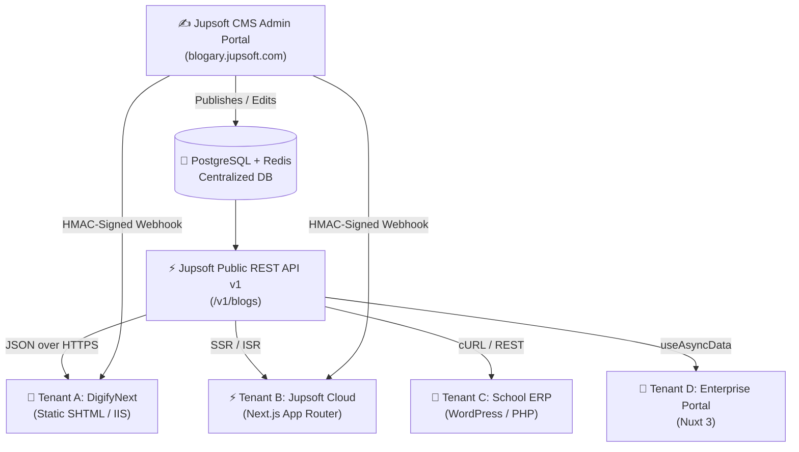

# 🌐 Jupsoft Centralized Blog Platform: Multi-Site Integration Master Guide

> **Target Audience:** Frontend Engineers, Full-Stack Developers, DevOps, and CMS Administrators.  
> **Purpose:** Step-by-step master instructions to integrate **ANY** website (Static SHTML, Next.js, WordPress/PHP, Nuxt/Vue, etc.) with the Jupsoft Centralized Multi-Tenant Blog Engine.

---

## 📑 Table of Contents
1. [Architecture & Workflow Overview](#1-architecture--workflow-overview)
2. [Step 1: CMS Super-Admin Tenant Setup](#2-step-1-cms-super-admin-tenant-setup)
3. [Step 2: Framework Integration Blueprints](#3-step-2-framework-integration-blueprints)
   - [Blueprint A: Static HTML / SHTML (IIS & Apache)](#blueprint-a-static-html--shtml-iis--apache)
   - [Blueprint B: Next.js (App Router, ISR, TypeScript)](#blueprint-b-nextjs-app-router-isr-typescript)
   - [Blueprint C: PHP / WordPress / Laravel](#blueprint-c-php--wordpress--laravel)
   - [Blueprint D: Vue.js / Nuxt 3](#blueprint-d-vuejs--nuxt-3)
4. [Step 3: Multi-Language (i18n) Engine](#4-step-3-multi-language-i18n-engine)
5. [Step 4: Real-Time Webhooks & Cache Invalidation](#5-step-4-real-time-webhooks--cache-invalidation)
6. [Step 5: SEO, OpenGraph & Schema.org JSON-LD](#6-step-5-seo-opengraph--schemaorg-json-ld)
7. [Step 6: Pre-Flight Production Launch Checklist](#7-step-6-pre-flight-production-launch-checklist)

---

## 1. Architecture & Workflow Overview



### Key Principles
1. **Single Source of Truth:** All articles, media, categories, tags, and SEO metadata live in the Centralized CMS.
2. **Framework Agnostic:** Consuming websites only need to fetch standard JSON from the public API endpoint (`https://blogary.jupsoft.com/v1/blogs`).
3. **Multi-Tenancy:** Each website has a unique `websiteId` and security `apiKey`. Data isolation is strictly enforced at the database level.
4. **4-Language Localization:** Full native support for English (`en`), Hindi (`hi`), French (`fr`), and Arabic (`ar`).

---

## 2. Step 1: CMS Super-Admin Tenant Setup

Before adding blog code to any new website, the site must be onboarded in the CMS:

### Method A: Via Admin Portal UI
1. Log in to [https://blogary.jupsoft.com](https://blogary.jupsoft.com) as Super Admin.
2. Navigate to **Settings** (`/settings`) ➔ **Tenant Websites**.
3. Click **Add New Website** and enter:
   - **Name:** e.g., `DigifyNext`, `Jupsoft Cloud`, `SchoolPro ERP`
   - **Slug / Website ID:** e.g., `site-digifynext`, `site-jupsoft`
   - **Domain:** e.g., `digifynext.com`, `jupsoft.com`
   - **Default Language:** `en` (or `hi`)
   - **Supported Languages:** Check `en`, `hi`, `fr`, `ar`
   - **Webhook URL:** e.g., `https://example.com/api/revalidate`
   - **Webhook Secret:** Enter a random 32-character secret for HMAC verification.
4. Save the site and copy your:
   - **`websiteId`**
   - **`apiKey`** (Header: `x-api-key`)

### Method B: Via FastMCP Tool / Backend CLI
```bash
# Using FastMCP tool:
create_website(
  name="DigifyNext",
  domain="digifynext.com",
  slug="digifynext",
  defaultLanguage="en",
  supportedLanguages=["en", "hi", "fr", "ar"],
  webhookUrl="https://digifynext.com/api/revalidate",
  webhookSecret="super_secret_webhook_key_32_chars"
)
```

---

## 3. Step 2: Framework Integration Blueprints

---

### Blueprint A: Static HTML / SHTML (IIS & Apache)
*Best for: Legacy sites, high-speed static landing sites, HTML/SHTML templates (e.g. DigifyNext).*

#### 1. File Structure
```
website-root/
├── blogs.shtml          # Blog Listing Grid & Search page
├── blog-detail.shtml    # Single Article Reader & SEO page
├── web.config           # (For Windows IIS) URL Rewrite rules
└── .htaccess            # (For Linux Apache) URL Rewrite rules
```

#### 2. Configuration Object (`CMS_CONFIG`)
Place at the top of your `<script>` in both `.shtml` files:
```javascript
const CMS_CONFIG = {
  apiUrl: 'https://blogary.jupsoft.com',
  websiteId: 'YOUR_WEBSITE_ID',      // e.g. 'site-digifynext'
  apiKey: 'YOUR_WEBSITE_API_KEY'     // e.g. 'jup_sec_...'
};
```

#### 3. Listing Page Integration (`blogs.shtml`)
```html
<!-- Toolbar: Search + Language Dropdown + View Toggle -->
<div class="blog-toolbar">
  <div class="blog-search">
    <input type="text" id="blogSearch" placeholder="Search articles...">
  </div>
  <div class="blog-lang-wrap">
    <select id="blogLangSelect">
      <option value="en">English (EN)</option>
      <option value="hi">हिन्दी (HI)</option>
      <option value="fr">Français (FR)</option>
      <option value="ar">العربية (AR)</option>
    </select>
  </div>
  <div class="blog-tabs" id="blogTabs"></div>
  <div class="blog-grid" id="blogGrid"></div>
</div>

<script>
(function() {
  const urlParams = new URLSearchParams(window.location.search);
  const currentLang = (urlParams.get('lang') || 'en').toLowerCase();

  // Sync dropdown
  const langSelect = document.getElementById('blogLangSelect');
  if (langSelect) {
    langSelect.value = currentLang;
    langSelect.addEventListener('change', function() {
      const u = new URL(window.location.href);
      u.searchParams.set('lang', this.value);
      window.location.href = u.toString();
    });
  }

  // Fetch blogs from Centralized CMS
  fetch(CMS_CONFIG.apiUrl + '/v1/blogs?website=' + encodeURIComponent(CMS_CONFIG.websiteId) + '&limit=50&lang=' + encodeURIComponent(currentLang), {
    headers: { 'Accept': 'application/json', 'x-api-key': CMS_CONFIG.apiKey }
  })
    .then(res => res.json())
    .then(json => {
      const blogs = json.data || [];
      renderCards(blogs);
    });

  function renderCards(list) {
    const grid = document.getElementById('blogGrid');
    grid.innerHTML = list.map(b => {
      const link = '/blog-detail.shtml?slug=' + encodeURIComponent(b.slug) + (currentLang !== 'en' ? '&lang=' + currentLang : '');
      const date = b.publishedAt ? new Date(b.publishedAt).toLocaleDateString(currentLang === 'hi' ? 'hi-IN' : 'en-US', { month: 'short', day: 'numeric', year: 'numeric' }) : '';
      return `<div class="card">
        <a href="${link}">
          
          <h3>${b.title}</h3>
          <span>${date}</span>
        </a>
      </div>`;
    }).join('');
  }
})();
</script>
```

#### 4. Detail Page Integration (`blog-detail.shtml`)
```html
<h1 id="articleTitle">Loading...</h1>
<div id="articleMeta">
  <span id="articleDate"></span>
  <div id="articleLangSwitch"></div>
</div>

<div id="articleBody"></div>

<script>
(function() {
  const urlParams = new URLSearchParams(window.location.search);
  const currentLang = (urlParams.get('lang') || 'en').toLowerCase();
  
  // Extract slug from ?slug= or /blog/slug
  const slug = urlParams.get('slug') || window.location.pathname.split('/').pop().replace('.shtml','');

  fetch(CMS_CONFIG.apiUrl + '/v1/blogs/' + encodeURIComponent(slug) + '?website=' + encodeURIComponent(CMS_CONFIG.websiteId) + '&lang=' + encodeURIComponent(currentLang), {
    headers: { 'Accept': 'application/json', 'x-api-key': CMS_CONFIG.apiKey }
  })
    .then(res => res.json())
    .then(json => {
      const blog = json.data;
      document.title = (blog.seo && blog.seo.metaTitle) || blog.title;
      document.getElementById('articleTitle').innerText = blog.title;
      document.getElementById('articleBody').innerHTML = blog.content;
      document.getElementById('articleHeroImg').src = blog.featuredImage;

      // Render Multi-Language Switcher
      const langBox = document.getElementById('articleLangSwitch');
      if (langBox && blog.translations) {
        langBox.innerHTML = blog.translations.map(t => {
          const isActive = t.lang === currentLang;
          return `<a href="/blog-detail.shtml?slug=${encodeURIComponent(t.slug)}&lang=${t.lang}" class="${isActive ? 'active' : ''}">${t.lang.toUpperCase()}</a>`;
        }).join(' | ');
      }

      // Inject SEO & JSON-LD
      if (blog.schemaJsonLd) {
        const s = document.createElement('script');
        s.type = 'application/ld+json';
        s.textContent = JSON.stringify(blog.schemaJsonLd);
        document.head.appendChild(s);
      }
    });
})();
</script>
```

#### 5. URL Rewriting for Clean URLs (`/blog/my-article`)
* **Windows IIS (`web.config`):**
  ```xml
  <rule name="BlogDetailRewrite" stopProcessing="true">
    <match url="^blog/([^/]+)/?$" />
    <action type="Rewrite" url="/blog-detail.shtml?slug={R:1}" appendQueryString="true" />
  </rule>
  ```
* **Linux Apache (`.htaccess`):**
  ```apache
  RewriteEngine On
  RewriteRule ^blog/([^/]+)/?$ /blog-detail.shtml?slug=$1 [L,QSA]
  ```
* **Linux Nginx (`nginx.conf`):**
  ```nginx
  location /blog/ {
    rewrite ^/blog/([^/]+)/?$ /blog-detail.shtml?slug=$1 last;
  }
  ```

---

### Blueprint B: Next.js (App Router, ISR, TypeScript)
*Best for: Modern React web applications, optimal SEO, sub-millisecond edge rendering.*

#### 1. File Structure
```
app/
├── [locale]/
│   └── blog/
│       ├── page.tsx               # Blog Listing Server Component
│       └── [slug]/
│           └── page.tsx           # Blog Detail with generateMetadata()
└── api/
    └── revalidate/
        └── route.ts               # On-Demand Webhook Revalidation Endpoint
```

#### 2. Environment Variables (`.env.local`)
```env
CMS_API_URL=https://blogary.jupsoft.com
CMS_WEBSITE_ID=site-digifynext
CMS_API_KEY=jup_sec_a5ad7c57709f48d2b75b080960dc6528
CMS_WEBHOOK_SECRET=your_32_character_webhook_secret
```

#### 3. Listing Page (`app/[locale]/blog/page.tsx`)
```tsx
import Link from 'next/link';

export const revalidate = 3600; // Incremental Static Regeneration (1 hr fallback)

async function getBlogs(locale: string) {
  const res = await fetch(
    `${process.env.CMS_API_URL}/v1/blogs?website=${process.env.CMS_WEBSITE_ID}&lang=${locale}&limit=50`,
    {
      headers: { 'x-api-key': process.env.CMS_API_KEY! },
      next: { tags: ['blogs'] }
    }
  );
  if (!res.ok) throw new Error('Failed to fetch blogs');
  return res.json();
}

export default async function BlogListingPage({ params }: { params: { locale: string } }) {
  const { data: blogs } = await getBlogs(params.locale);

  return (
    <div className="container mx-auto py-12">
      <h1 className="text-4xl font-bold mb-8">Latest Insights</h1>
      <div className="grid grid-cols-1 md:grid-cols-3 gap-8">
        {blogs.map((b: any) => (
          <article key={b.id} className="border rounded-xl overflow-hidden shadow-sm hover:shadow-md transition">
            
            <div className="p-6">
              <span className="text-xs font-semibold text-blue-600">{b.primaryCategory}</span>
              <h2 className="text-xl font-bold mt-2">
                <Link href={`/${params.locale}/blog/${b.slug}`}>{b.title}</Link>
              </h2>
              <p className="text-gray-600 text-sm mt-2">{b.excerpt}</p>
            </div>
          </article>
        ))}
      </div>
    </div>
  );
}
```

#### 4. Detail Page with SEO (`app/[locale]/blog/[slug]/page.tsx`)
```tsx
import { Metadata } from 'next';
import { notFound } from 'next/navigation';

interface Props {
  params: { locale: string; slug: string };
}

async function getBlog(slug: string, locale: string) {
  const res = await fetch(
    `${process.env.CMS_API_URL}/v1/blogs/${encodeURIComponent(slug)}?website=${process.env.CMS_WEBSITE_ID}&lang=${locale}`,
    {
      headers: { 'x-api-key': process.env.CMS_API_KEY! },
      next: { tags: [`blog-${slug}`] }
    }
  );
  if (!res.ok) return null;
  const json = await res.json();
  return json.data;
}

export async function generateMetadata({ params }: Props): Promise<Metadata> {
  const blog = await getBlog(params.slug, params.locale);
  if (!blog) return { title: 'Article Not Found' };

  return {
    title: blog.seo?.metaTitle || blog.title,
    description: blog.seo?.metaDescription || blog.excerpt,
    alternates: {
      canonical: blog.seo?.canonicalUrl,
      languages: (blog.seo?.hreflang || []).reduce((acc: any, h: any) => {
        acc[h.lang] = h.href;
        return acc;
      }, {})
    },
    openGraph: {
      title: blog.seo?.ogTitle || blog.title,
      description: blog.seo?.ogDescription || blog.excerpt,
      images: [blog.seo?.ogImage || blog.featuredImage]
    }
  };
}

export default async function BlogDetailPage({ params }: Props) {
  const blog = await getBlog(params.slug, params.locale);
  if (!blog) notFound();

  return (
    <article className="max-w-4xl mx-auto py-12 px-4">
      {/* Schema.org JSON-LD */}
      {blog.schemaJsonLd && (
        <script
          type="application/ld+json"
          dangerouslySetInnerHTML={{ __html: JSON.stringify(blog.schemaJsonLd) }}
        />
      )}

      {/* Language Switcher */}
      <div className="flex gap-2 mb-6">
        {blog.translations?.map((t: any) => (
          <Link
            key={t.lang}
            href={`/${t.lang}/blog/${t.slug}`}
            className={`px-3 py-1 rounded text-xs font-semibold ${t.lang === params.locale ? 'bg-blue-600 text-white' : 'bg-gray-100 text-gray-700'}`}
          >
            {t.lang.toUpperCase()}
          </Link>
        ))}
      </div>

      <h1 className="text-4xl font-extrabold mb-4">{blog.title}</h1>
      <p className="text-gray-500 mb-8">Published on {new Date(blog.publishedAt).toLocaleDateString()}</p>
      
      <div
        className="prose prose-lg max-w-none"
        dangerouslySetInnerHTML={{ __html: blog.content }}
      />
    </article>
  );
}
```

#### 5. Webhook Revalidation Endpoint (`app/api/revalidate/route.ts`)
```typescript
import { NextRequest, NextResponse } from 'next/server';
import crypto from 'crypto';
import { revalidateTag } from 'next/cache';

export async function POST(req: NextRequest) {
  const secret = process.env.CMS_WEBHOOK_SECRET;
  const signature = req.headers.get('x-jupsoft-signature');
  const bodyText = await req.text();

  // 1. Verify HMAC Signature
  if (secret && signature) {
    const hmac = crypto.createHmac('sha256', secret).update(bodyText).digest('hex');
    if (hmac !== signature) {
      return NextResponse.json({ message: 'Invalid HMAC signature' }, { status: 401 });
    }
  }

  const payload = JSON.parse(bodyText);
  const { event, slug } = payload;

  // 2. Invalidate cache tags
  revalidateTag('blogs');
  if (slug) {
    revalidateTag(`blog-${slug}`);
  }

  return NextResponse.json({ revalidated: true, event, now: Date.now() });
}
```

---

### Blueprint C: PHP / WordPress / Laravel
*Best for: WordPress sites, custom PHP applications, Laravel backends.*

#### PHP Helper Class (`JupsoftBlogClient.php`)
```php
<?php
class JupsoftBlogClient {
    private $apiUrl = 'https://blogary.jupsoft.com';
    private $websiteId;
    private $apiKey;

    public function __construct($websiteId, $apiKey) {
        $this->websiteId = $websiteId;
        $this->apiKey = $apiKey;
    }

    public function getBlogs($lang = 'en', $limit = 50) {
        $url = "{$this->apiUrl}/v1/blogs?website={$this->websiteId}&lang={$lang}&limit={$limit}";
        return $this->request($url);
    }

    public function getBlogBySlug($slug, $lang = 'en') {
        $url = "{$this->apiUrl}/v1/blogs/" . urlencode($slug) . "?website={$this->websiteId}&lang={$lang}";
        return $this->request($url);
    }

    private function request($url) {
        $ch = curl_init($url);
        curl_setopt($ch, CURLOPT_RETURNTRANSFER, true);
        curl_setopt($ch, CURLOPT_HTTPHEADER, [
            'Accept: application/json',
            'x-api-key: ' . $this->apiKey
        ]);
        curl_setopt($ch, CURLOPT_TIMEOUT, 5);
        $response = curl_exec($ch);
        curl_close($ch);
        $json = json_decode($response, true);
        return $json['data'] ?? null;
    }
}
```

---

### Blueprint D: Vue.js / Nuxt 3
*Best for: Vue 3 applications with SSR & full hydration.*

```vue
<!-- pages/blog/[slug].vue -->
<script setup>
const route = useRoute();
const config = useRuntimeConfig();
const slug = route.params.slug;
const lang = route.query.lang || 'en';

const { data: blog } = await useAsyncData(`blog-${slug}-${lang}`, () =>
  $fetch(`https://blogary.jupsoft.com/v1/blogs/${encodeURIComponent(slug)}`, {
    params: { website: 'site-digifynext', lang },
    headers: { 'x-api-key': 'your_api_key' }
  }).then(r => r.data)
);

useHead({
  title: computed(() => blog.value?.seo?.metaTitle || blog.value?.title),
  meta: [
    { name: 'description', content: computed(() => blog.value?.seo?.metaDescription || blog.value?.excerpt) },
    { property: 'og:image', content: computed(() => blog.value?.seo?.ogImage || blog.value?.featuredImage) }
  ]
});
</script>

<template>
  <div v-if="blog" class="blog-container">
    <h1>{{ blog.title }}</h1>
    <div v-html="blog.content"></div>
  </div>
</template>
```

---

## 4. Step 3: Multi-Language (i18n) Engine

The CMS provides a native 4-language dictionary per article:
- **`en`**: English (Default)
- **`hi`**: हिन्दी (Hindi)
- **`fr`**: Français (French)
- **`ar`**: العربية (Arabic - RTL)

### Language Resolution Behavior
1. If an article has a Hindi translation and the client requests `?lang=hi`, the API responds with the localized Hindi title, slug, excerpt, content, and SEO metadata.
2. If an article does **not** have a translation for the requested language, the API gracefully falls back to the **default language (`en`)**.
3. Consuming websites should always inspect the `translations` array returned in the single blog response:
   ```json
   "translations": [
     { "lang": "en", "slug": "best-seo-tips-2026", "title": "Best SEO Tips for 2026" },
     { "lang": "hi", "slug": "2026-ke-behtareen-seo-tips", "title": "2026 के बेहतरीन SEO टिप्स" }
   ]
   ```
4. Clicking a language switch tab should navigate to the **translated slug** for that language.

---

## 5. Step 4: Real-Time Webhooks & Cache Invalidation

Whenever an editor **Publishes**, **Updates**, or **Unpublishes** an article in the CMS Admin Portal, the CMS dispatches an HTTP POST event to the website's configured `webhookUrl`.

### Webhook Event Payload
```json
{
  "event": "blog.published",
  "websiteId": "site-digifynext",
  "blogId": "blg_99f3818e_2026",
  "slug": "best-seo-tips-2026",
  "action": "CREATE",
  "timestamp": 1774351200000
}
```

### Signature Verification (HMAC SHA-256)
All webhooks carry the header:
```http
x-jupsoft-signature: a591a6d40bf420404a011733527b533475822ffc0...
```
**Verification formula:**
$$\text{HMAC-SHA256}(\text{rawRequestBody}, \text{webhookSecret}) = \text{x-jupsoft-signature}$$

---

## 6. Step 5: SEO, OpenGraph & Schema.org JSON-LD

The CMS API returns pre-computed, Google-compliant SEO metadata in every single blog payload:

```json
"seo": {
  "metaTitle": "Top 10 AI SEO Strategies for 2026 | DigifyNext",
  "metaDescription": "Discover how AI engines index and rank web content in 2026.",
  "canonicalUrl": "https://digifynext.com/blog/ai-seo-strategies-2026",
  "ogImage": "https://blogary.jupsoft.com/uploads/hero.webp",
  "robots": "index, follow",
  "hreflang": [
    { "lang": "en", "href": "https://digifynext.com/blog/ai-seo-strategies-2026?lang=en" },
    { "lang": "hi", "href": "https://digifynext.com/blog/ai-seo-strategies-hindi?lang=hi" }
  ]
},
"schemaJsonLd": {
  "@context": "https://schema.org",
  "@type": "BlogPosting",
  "headline": "Top 10 AI SEO Strategies for 2026",
  "image": ["https://blogary.jupsoft.com/uploads/hero.webp"],
  "datePublished": "2026-03-24T00:00:00.000Z",
  "author": { "@type": "Person", "name": "DigifyNext Team" }
}
```

Consuming sites only need to dump `schemaJsonLd` directly into `<script type="application/ld+json">`.

---

## 7. Step 6: Pre-Flight Production Launch Checklist

Before flipping the DNS or making the blog public:

| # | Check Item | Verification Action | Pass? |
|:-:|:---|:---|:-:|
| 1 | **Website Onboarding** | Website created in CMS with valid domain and unique `websiteId`. | 🔲 |
| 2 | **API Connectivity** | `GET /v1/blogs?website=YOUR_SITE_ID` returns HTTP 200 with JSON data. | 🔲 |
| 3 | **CORS Configuration** | Consuming domain added to backend CORS whitelist (`CORS_ORIGINS`). | 🔲 |
| 4 | **Clean URL Rewriting** | Visiting `/blog/test-slug` loads the blog detail page without 404. | 🔲 |
| 5 | **Language Switcher** | Switching from EN ➔ HI loads Hindi content and updates URL `?lang=hi`. | 🔲 |
| 6 | **SEO Meta Tags** | Page `<head>` contains dynamic `<title>`, `<meta description>`, and `<link canonical>`. | 🔲 |
| 7 | **Structured Data (Schema)** | Verified via [Google Rich Results Test](https://search.google.com/test/rich-results). | 🔲 |
| 8 | **Image CDN / WebP** | Images load over HTTPS and render responsive WebP formats. | 🔲 |
| 9 | **Webhook Invalidation** | Publishing a post in Admin updates the consuming site within seconds. | 🔲 |
| 10 | **Fallback States** | Error state ("Article Not Found") renders gracefully if slug does not exist. | 🔲 |

---

*Authored by Jupsoft Engineering Team • Version 1.0 (2026) • All Rights Reserved.*
