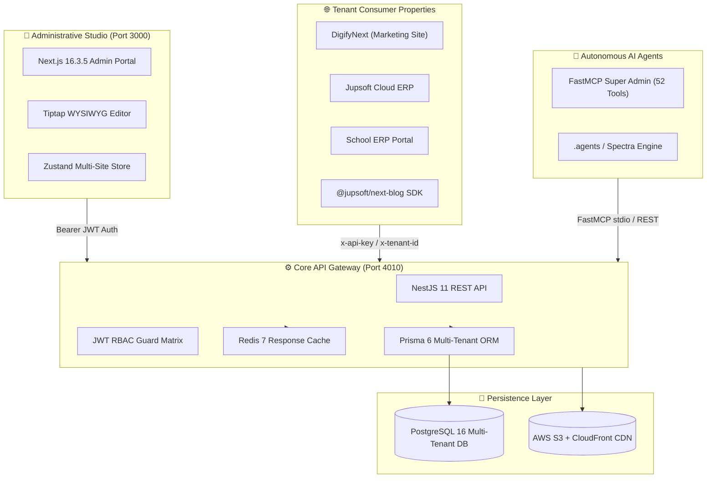

# 🚀 Jupsoft Centralized Multi-Site Blog Management Platform

<p align="center">
  
  
  
  
  
</p>

Enterprise multi-tenant content management hub designed to power all Jupsoft domains and client properties (*DigifyNext*, *Jupsoft Cloud ERP*, *School ERP*, etc.) from a single high-velocity administrative studio.

---

## 🏛️ System Architecture Topology



---

## 🗂️ Enterprise Monorepo Structure

```
jupsoft-centralized-blog-platform/
│
├── 📁 .agents/                      # Autonomous AI Agent Skills (MCP, Spectra, Blog Ingestion)
│   └── skills/                      # Enterprise skill definition playbooks
│
├── 📁 .github/                      # Enterprise CI/CD Pipeline
│   └── workflows/
│       └── ci.yml                   # Automated TypeScript Check, Lint & Build Verification
│
├── 🌐 admin-portal/                 # [Application] Next.js 16 Editorial Studio UI
│   ├── src/                         # Clean Architecture (app, components, hooks, lib, store)
│   ├── public/                      # Static brand assets & studio typography
│   ├── Dockerfile                   # Multi-stage production container definition
│   └── package.json                 # Next.js workspace package specification
│
├── ⚙️ backend/                      # [Application] NestJS 11 Core Enterprise Multi-Site REST API
│   ├── prisma/                      # Multi-Tenant Database Schema, Migrations & Seeds
│   │   ├── schema.prisma            # Strictly-typed PostgreSQL data models
│   │   └── seed.example.ts          # Comprehensive production website & user seeder
│   ├── src/                         # Modular Architecture (auth, blogs, websites, redis, s3)
│   ├── Dockerfile                   # Multi-stage production container definition
│   ├── docker-compose.yml           # Local development PostgreSQL & Redis services
│   └── package.json                 # NestJS workspace package specification
│
├── 📦 packages/                     # [Shared Workspace Packages & Client SDKs]
│   └── next-blog/                   # @jupsoft/next-blog: Zero-config Next.js Blog Engine SDK
│       ├── src/                     # Core client, ISR webhook & metadata generators
│       ├── dist/                    # Compiled dual CommonJS + ESM distribution
│       └── package.json             # Published npm package definition
│
├── 🌍 digifynext/                   # [Tenant Reference Client] Live Production Website Integration
│   ├── api/                         # Client-side dynamic API handlers
│   ├── css/ & js/                   # Responsive styles & client scripts
│   ├── blog.html                    # Dynamic multi-tenant blog catalog grid
│   ├── blogdetail.html              # Dynamic SEO-optimized blog detail reader
│   └── README.md                    # Integration & deployment specifications
│
├── 🤖 jupsoft-cms-mcp/              # [AI Tooling] FastMCP AI Agent Super Admin Server
│   ├── src/                         # 52 autonomous Python tools covering all CMS modules
│   ├── pyproject.toml               # Poetry/pip build configuration
│   └── README.md                    # Tool documentation & AI model connection guide
│
├── 📝 blogs/                        # [Content Hub] Migrated Articles & WebP Media Pipeline
│   ├── digifynext/                  # Source Markdown articles with authentic publication dates
│   ├── images/                      # Original high-resolution source graphics
│   ├── images-webp/                 # Compressed Next-Gen WebP delivery formats
│   ├── upload-pipeline.js           # Automated cloud ingestion pipeline
│   └── README.md                    # Asset ingestion guide
│
├── 📚 docs/                         # [Documentation Hub] Master Technical Architecture & Specs
│   ├── architecture/                # Developer Onboarding, CONTEXT.md, Migration SOPs
│   ├── guides/                      # Enterprise SEO & Generative Engine Optimization (GEO)
│   ├── reports/                     # Audit Reports, Scorecards & Migration Telemetry
│   ├── specs/                       # Official PRD & TRD Contractual Specifications
│   └── README.md                    # Master Documentation Index & Navigation Guide
│
├── 📄 .editorconfig                 # Standard enterprise indentation & UTF-8 formatting rules
├── 📄 .gitignore                    # Hardened Gitignore (caches, build artifacts, test media)
├── 📄 .dockerignore                 # Docker build cache optimization
├── 📄 ecosystem.config.js           # PM2 Production Process Manager Configuration
├── 📄 deploy-vps.sh                 # Zero-Downtime Smart VPS Deployment Engine
├── 📄 package.json                  # Root Monorepo Scripts & Workspaces
├── 📄 pnpm-workspace.yaml           # pnpm package inclusion ('admin-portal', 'backend', 'packages/*')
└── 📄 README.md                     # Master Repository Showcase Documentation
```

---

## ⚡ Quick Start (Fresh Machine Setup)

### 1. Prerequisites
- **Node.js**: v20+ LTS (Tested on v20 LTS and v24)
- **pnpm**: v9+ (`npm install -g pnpm`)
- **Docker**: Optional (for local PostgreSQL & Redis)

### 2. Installation & Setup
```bash
# Clone the repository
git clone https://github.com/virajverse/jupsoft-centralized-blog-platform.git
cd jupsoft-centralized-blog-platform

# Install monorepo dependencies
pnpm install

# Start local PostgreSQL & Redis (Docker)
cd backend && docker compose up -d && cd ..

# Generate Prisma Client & Push Database Schema
pnpm db:generate
pnpm db:push
```

### 3. Launch Development Servers Concurrently
```bash
pnpm dev
```

- **Admin Studio UI:** [http://localhost:3000](http://localhost:3000)
- **Backend API:** [http://localhost:4000](http://localhost:4000) (or 4010 in production)
- **Swagger Documentation:** [http://localhost:4000/api/docs](http://localhost:4000/api/docs)
- **Prisma Studio (Visual Database UI):** `pnpm db:studio` → [http://localhost:5555](http://localhost:5555)

---

## 🚀 Production VPS Deployment (Zero-Downtime)

The project includes an intelligent, zero-downtime deployment engine at `deploy-vps.sh`:

```bash
# On the production server:
cd /var/www/blogary.jupsoft.com
bash deploy-vps.sh
```

### Deployment Automation Features:
1. **Smart Diff Detection**: Compares `git rev-parse HEAD` against remote to identify exactly which service changed.
2. **Selective Compilation**: Skips backend compilation if only frontend changed (and vice versa), saving 80% build time.
3. **RAM-Safe Build**: Manages Node memory via `--max-old-space-size=1024` to prevent OOM errors on modest VPS hardware.
4. **Zero-Downtime Reload**: Uses `pm2 reload all --update-env` to gracefully replace Node workers without dropping live user traffic.

---

## 📋 Technology & Package Matrix

| Component | Selected Technology | Purpose & Scope |
| :--- | :--- | :--- |
| **Admin Studio** | Next.js 16.3.5 (App Router, React 19) | Multi-tenant editorial portal, SSR/ISR, zero CLS |
| **Styling & Icons** | Tailwind CSS v4 + Lucide Icons | Deep-space responsive enterprise design system |
| **Rich Text Editor** | Tiptap WYSIWYG Suite | Structured JSON/HTML formatting, SEO auditor, tables, code blocks |
| **Core API Gateway** | NestJS 11 (Express, TypeScript) | Modular REST API, JWT RBAC, dynamic CORS whitelist, Swagger |
| **ORM & Database** | Prisma ORM 6 + PostgreSQL 16 | Strictly mapped multi-tenant relational data models |
| **Caching Layer** | Redis 7 Alpine | Sub-300ms public reads, session tokens, API rate limiting |
| **Media Pipeline** | AWS S3 + CloudFront CDN + Sharp | Automated WebP compression pipeline, alt-text enforcement |
| **Client SDK** | `@jupsoft/next-blog` | Plug-and-play Next.js package for instant tenant onboarding |
| **Autonomous AI** | FastMCP Python (52 Tools) | Full AI programmatic control for automated content operations |

---

## ✨ Enterprise Capabilities

- **True Multi-Tenancy**: A single centralized database powers infinite client properties with strict tenant data isolation.
- **Granular RBAC**: Role-based access control (*Super Admin*, *Website Admin*, *Editor*, *Writer*) with per-module capability toggles.
- **Multilingual Localization**: Native support for multi-language articles (English, Hindi, French, Arabic, etc.) with SEO hreflang parity.
- **Publication Date Governance**: Accurate historical backdating or scheduled future-dated publishing with automated background cron release.
- **FastMCP 52-Tool AI Super Admin**: Enables AI agents (Antigravity, Claude, ChatGPT) to programmatically manage blogs, categories, users, redirects, and media.
- **Instant ISR Webhook Invalidation**: Live tenant websites automatically revalidate and re-render the moment an article is published or updated.
- **SEO & Generative Engine Optimization (GEO)**: Built-in OpenGraph cards, Twitter cards, JSON-LD structured schemas, and LLM-friendly semantic markup.

---

## 📖 Master Documentation Hub

For in-depth architectural blueprints, setup workflows, and migration tracking, refer to the [**Documentation Hub**](./docs/README.md):

- [Architectural Context & Blueprint (`CONTEXT.md`)](./docs/architecture/CONTEXT.md)
- [Cross-Site Blog Migration Playbook](./docs/architecture/CROSS-SITE-BLOG-MIGRATION-PLAYBOOK.md)
- [SEO & Generative Engine Optimization Master Guide](./docs/guides/SEO-GEO-MASTER-GUIDE.md)
- [Multi-Site Migration Tracker & Compliance Scorecard](./docs/reports/JUPSOFT-BLOG-MIGRATION-TRACKER.md)
- [Executive Presentation Briefing](./docs/reports/EXECUTIVE_TECHNICAL_PRESENTATION_PPT.md)

---

## 🌐 Production Deployments

| Service | Environment | Endpoint |
| :--- | :--- | :--- |
| **Admin Studio UI** | Production | [https://blogary.jupsoft.com](https://blogary.jupsoft.com) |
| **Public REST API** | Production | [https://blogary.jupsoft.com/v1/blogs](https://blogary.jupsoft.com/v1/blogs) |
| **Interactive Swagger Docs** | Production | [https://blogary.jupsoft.com/api/docs](https://blogary.jupsoft.com/api/docs) |
| **Reference Client (DigifyNext)** | Production | [https://digifynext.com/blog](https://digifynext.com/blog) |

---

<p align="center">
  <b>Architected & Maintained by Viraj Srivastav (<code>virajverse</code>) for Jupsoft Systems Pvt. Ltd.</b>
</p>
