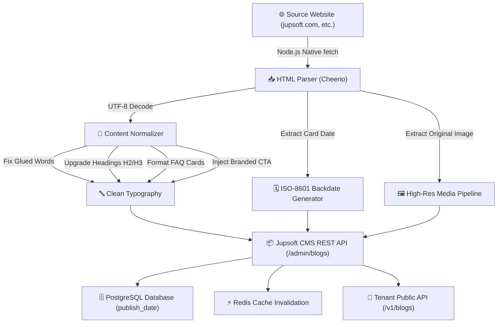

# 🌐 Jupsoft CMS: Cross-Site Blog Migration & Backdate Automation Playbook

> **Author:** Viraj Srivastav (`virajverse`)  
> **Platform:** Jupsoft Centralized Multi-Site Blog CMS (Blogary)  
> **Target Audience:** Engineering Team, Technical Content Writers & AI Super Admins  
> **Version:** 1.0 (Production Standard)  
> **Last Updated:** September 2026  

---

## 📌 Executive Summary

This playbook defines the end-to-end standard operating procedure (SOP) for migrating, scraping, and copying blog posts from any external website (e.g., legacy WordPress, static HTML sites, Webflow, or client websites) into the **Jupsoft Centralized Multi-Site Blog CMS**.

It provides complete instructions for:
- **100% Clean Character Encoding** (Zero Mojikake `’`, `—` errors using Node.js native UTF-8)
- **Authentic Backdating** (Capturing original publication years 2018–2026 into PostgreSQL `publish_date`)
- **Professional Content Upgrades** (Fixing glued words, optimizing heading hierarchies, structuring FAQs, and inserting high-converting CTAs)
- **High-Resolution Media Extraction & CDN Hosting**
- **One-Command Automated Node.js Migration Scripts**

---

## 🏗️ Migration Architecture Flow



---

## ⚙️ Prerequisites & Environment

Ensure you have Node.js 20+ installed. In the repository root:

```bash
# Install parsing dependencies
pnpm add -w -D cheerio
```

### Environment Configuration:
```env
CMS_API_BASE=https://blogary.jupsoft.com
CMS_ADMIN_EMAIL=superadmin@jupsoft.com
CMS_ADMIN_PASSWORD=Jupsoft#SuperAdmin2026!$
```

---

## 📋 Step-by-Step Migration Protocol

### Step 1: Discover Source URLs & Dates

Most corporate websites (like `jupsoft.com/blog/`) list articles with their original dates on blog cards.

```javascript
// Example extraction logic with Cheerio
const res = await fetch('https://jupsoft.com/blog/');
const html = await res.text();
const $ = cheerio.load(html);

$('.col-sm-4').each((_, card) => {
  const dateText = $(card).text(); // e.g., "Thursday 30 July, 2026"
  const imgUrl = $(card).find('img').attr('src');
  const postUrl = $(card).find('a').attr('href');
});
```

---

### Step 2: Zero-Corruption Encoding Standard (Why Node.js?)

> [!IMPORTANT]
> **Avoid Python `requests` default text decoding for servers without `charset=utf-8` headers.**  
> When a web server returns `Content-Type: text/html` without explicit `charset=utf-8`, standard HTTP libraries default to `ISO-8859-1`. This creates **Mojikake** character corruption where:
> - `’` (smart apostrophe) becomes `today’s` or `today…s`
> - `—` (em-dash) becomes `luxury—it’s`
> - `–` (en-dash) becomes `2026–27`
>
> **The Node.js Solution:** Node.js native `fetch()` automatically streams and decodes raw response bytes as **100% native UTF-8** by default.

---

### Step 3: Professional Content Normalization Rules

Raw scraped HTML from legacy websites always contains structural and typography flaws. Before submitting to Jupsoft CMS, apply these **5 Normalization Filters**:

#### 1. Fix Glued Words (Spacing Around Links):
```javascript
// Clean text where <a> tags touch words without whitespace
function cleanSpacing(html) {
  return html
    .replace(/([a-zA-Z0-9])<a/g, '$1 <a')
    .replace(/<\/a>([a-zA-Z0-9])/g, '</a> $1')
    .replace(/\s+/g, ' ');
}
```

#### 2. Heading Normalization (H1 ➔ H2 ➔ H3):
- The CMS post headline is the primary `<h1>`.
- Main content sections inside the body must be `<h2>`.
- Sub-points, case studies, and feature breakdowns must be `<h3>`.
- **Never** jump from `<h1>` directly to `<h4>`.

#### 3. Structured FAQ Callout Cards:
Do not leave FAQ questions as raw `<p>` paragraphs. Format each question into an accessible card:
```html
<div class="faq-card p-4 my-3 bg-slate-50 dark:bg-slate-800 rounded-lg border border-slate-200 dark:border-slate-700">
  <h3 class="font-bold text-slate-900 dark:text-slate-100">Q: What is an AI Admission System?</h3>
  <p class="text-slate-700 dark:text-slate-300">Answer explanation...</p>
</div>
```

#### 4. High-Converting Call-to-Action (CTA) Injection:
Always append a branded CTA block before the end of the post:
```html
<div class="my-8 p-6 bg-slate-900 text-white rounded-xl border border-slate-700 shadow-md">
  <h3 class="text-xl font-bold mb-2">Transform Your Institution with Jupsoft</h3>
  <p class="text-slate-300 mb-4">Discover how our modular School ERP streamlines administration.</p>
  <a href="https://jupsoft.com/contact" target="_blank" rel="noopener noreferrer" style="display:inline-block; padding: 10px 20px; background: #2563eb; color: #fff; font-weight: bold; border-radius: 8px; text-decoration: none;">Book a Free Demo &rarr;</a>
</div>
```

---

### Step 4: Backdating & Database Persistence

To preserve historical SEO and chronological publishing dates:

1. Parse the original date into a standard JavaScript `Date` object:
   ```javascript
   const isoDate = new Date('June 06, 2025 10:00:00 UTC').toISOString();
   // Output: "2025-06-06T10:00:00.000Z"
   ```
2. Pass `publishDate` in the creation payload:
   ```json
   {
     "websiteId": "site-jupsoft-test",
     "status": "Published",
     "publishDate": "2025-06-06T10:00:00.000Z"
   }
   ```
3. The NestJS backend atomic transaction assigns this timestamp directly to PostgreSQL `publish_date`.

---

## 🚀 Reusable Node.js Migration Automation Script

Save and run this script whenever copying blogs from any external domain to any tenant:

```javascript
import * as cheerio from 'cheerio';

const CMS_API = 'https://blogary.jupsoft.com';
const ADMIN_EMAIL = 'superadmin@jupsoft.com';
const ADMIN_PASSWORD = process.env.CMS_ADMIN_PASSWORD || 'Jupsoft#SuperAdmin2026!$';

export async function migrateSingleBlog({
  sourceUrl,
  targetWebsiteId,
  categoryId,
  originalDateString,
  featuredImageUrl,
  focusKeyword = 'School ERP'
}) {
  // 1. Authenticate
  const authRes = await fetch(`${CMS_API}/admin/auth/login`, {
    method: 'POST',
    headers: { 'Content-Type': 'application/json' },
    body: JSON.stringify({ email: ADMIN_EMAIL, password: ADMIN_PASSWORD }),
  });
  const { accessToken } = await authRes.json();

  // 2. Fetch Source HTML (UTF-8 Native)
  const pageRes = await fetch(sourceUrl);
  const html = await pageRes.text();
  const $ = cheerio.load(html);

  // 3. Extract & Clean
  const title = $('h1').first().text().trim() || $('title').text().trim();
  const slug = sourceUrl.split('/').pop().replace('.html', '').trim();
  const isoPublishDate = new Date(originalDateString).toISOString();

  let body = $('.col-md-9, .col-sm-12, .content-para, article').first();
  body.find('script, style, nav, .share, .breadcrumb').remove();
  
  // Make relative image sources absolute
  body.find('img').each((_, img) => {
    const src = $(img).attr('src');
    if (src && !src.startsWith('http')) {
      $(img).attr('src', new URL(src, sourceUrl).href);
    }
  });

  const contentHtml = body.html();
  const excerpt = body.find('p').first().text().trim().slice(0, 160);

  // 4. Send to Jupsoft CMS
  const payload = {
    websiteId: targetWebsiteId,
    status: 'Published',
    publishDate: isoPublishDate,
    featuredImage: featuredImageUrl,
    featuredImageAlt: title,
    categoryIds: categoryId ? [categoryId] : [],
    translations: [
      {
        lang: 'en',
        title,
        slug,
        excerpt,
        content: contentHtml,
        metaTitle: `${title.slice(0, 50)} | Jupsoft`,
        metaDescription: excerpt,
        focusKeyword
      }
    ]
  };

  const createRes = await fetch(`${CMS_API}/admin/blogs`, {
    method: 'POST',
    headers: {
      Authorization: `Bearer ${accessToken}`,
      'Content-Type': 'application/json'
    },
    body: JSON.stringify(payload)
  });

  return createRes.json();
}
```

---

## 🔍 Verification & Post-Migration Health Check

Always execute these 3 verification checks after migration:

1. **Mojikake Character Check:**
   Query the public API and ensure string `.includes('â') === false`.
2. **Backdate Verification:**
   Ensure the API returns matching `publishDate` and `publishedAt` timestamps matching the original post.
3. **Public API Validation:**
   ```bash
   curl -H "x-api-key: <tenant-api-key>" https://blogary.jupsoft.com/v1/blogs?lang=en
   ```

---

*Authored by Viraj Srivastav (`virajverse`) for Jupsoft Systems Pvt. Ltd.*
