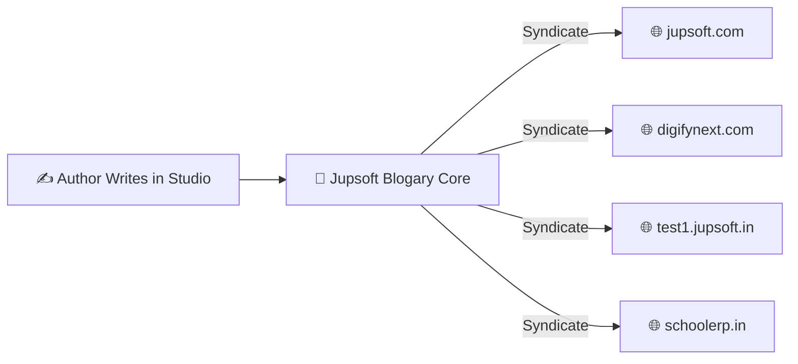
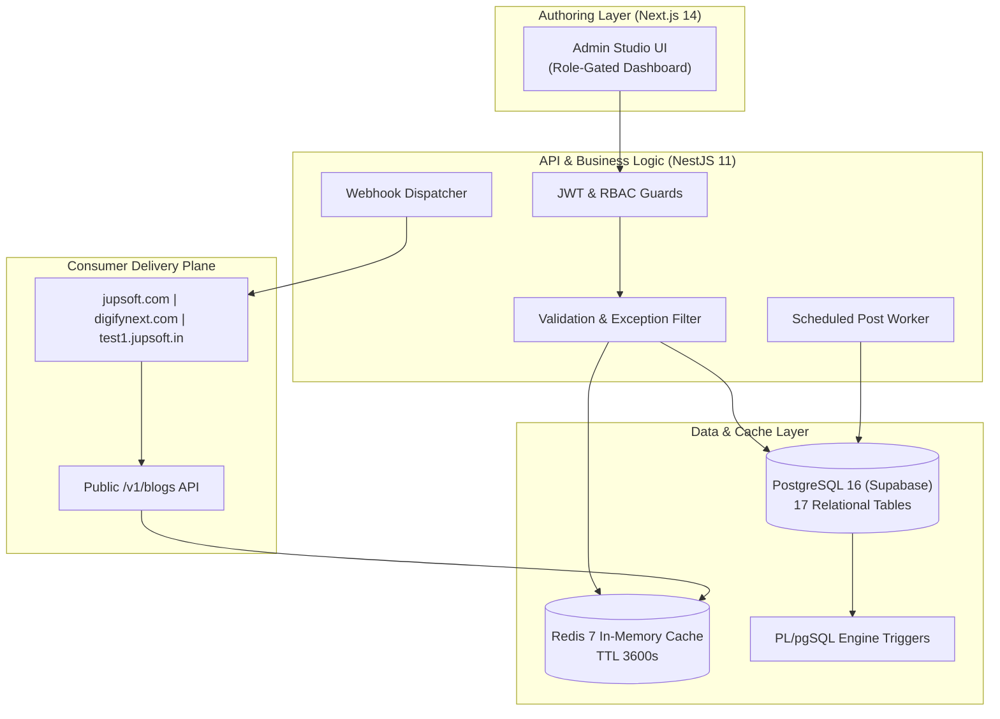

# 🖥️ Jupsoft Centralized Multi-Site Blog Platform
# Executive & Engineering Presentation Deck (PPT)

> **Deck Title:** Unifying Enterprise Publishing Across Jupsoft Digital Properties  
> **Presenter:** Engineering & Architecture Leadership  
> **Platform Name:** Jupsoft Blogary Centralized Multi-Site CMS  
> **Target Audience:** Board of Directors, Executive Leadership, Product Leads & Engineering Teams  
> **Live Production Platform:** [https://blogary.jupsoft.com](https://blogary.jupsoft.com)  

---

```
╔══════════════════════════════════════════════════════════════════════════════╗
║                               SLIDE 1                                        ║
║             Jupsoft Centralized Multi-Site Blog Platform                     ║
║              Enterprise Content Architecture & Delivery                      ║
╚══════════════════════════════════════════════════════════════════════════════╝
```

### 🎯 Slide Content:
* **Product:** Jupsoft Centralized Blog Engine (Blogary)
* **Tagline:** One Engine. Multiple Websites. Infinite Scale.
* **Architecture:** Decoupled Headless CMS (NestJS 11 + Next.js 14 + Supabase PostgreSQL 16 + Redis 7)
* **Scope:** Powers `jupsoft.com`, `cloud.jupsoft.com`, `digifynext.com`, `schoolerp.in`, `test1.jupsoft.in`.

> 🎙️ **Speaker Notes:**
> *"Good morning leadership team. Today we present the Jupsoft Centralized Multi-Site Blog Platform—a unified, high-performance content engine built from the ground up to replace fragmented legacy publishing tools with an enterprise, multi-tenant headless CMS."*

---

```
╔══════════════════════════════════════════════════════════════════════════════╗
║                               SLIDE 2                                        ║
║                The Problem: Fragmented Legacy Silos                          ║
╚══════════════════════════════════════════════════════════════════════════════╝
```

### ❌ The Legacy Challenges:
1. **Triplicate Maintenance:**
   Publishing an educational insight required manual copy-pasting across Jupsoft Corporate, DigifyNext, and School ERP.
2. **Encoding & Mojikake Corruption:**
   Legacy Python/PHP scrapers produced garbled characters (`today’s`, `luxury—it’s`), damaging professional branding.
3. **SEO & Slug Divergence:**
   Slugs were altered across domains, destroying backlink equity, canonical authority, and internal linking.
4. **Security Vulnerabilities:**
   Lack of database-level protection allowed accidental deletions and role permission escalations.

> 🎙️ **Speaker Notes:**
> *"Prior to this platform, managing blogs across three websites meant three separate logins, duplicate authoring time, and frequent encoding corruptions. Our primary goal was to create a single source of truth."*

---

```
╔══════════════════════════════════════════════════════════════════════════════╗
║                               SLIDE 3                                        ║
║                 The Solution: Decoupled Headless CMS                         ║
╚══════════════════════════════════════════════════════════════════════════════╝
```

### 💡 The Solution Highlights:
* **Single Authoring Studio:** Write, translate, and schedule once; syndicate to any registered domain in 1 click.
* **Clean Character Pipeline:** Native Node.js UTF-8 streaming ensures 0% character corruption.
* **100% Immutable Slug Preservation:** Guaranteed identity match between source and target URLs.
* **Multi-Tenant Redis Caching:** Sub-50ms public API response times across all tenant websites.



> 🎙️ **Speaker Notes:**
> *"The solution completely decouples authoring from delivery. Our content writers use a modern TipTap editor in our central studio, and the public REST APIs deliver pre-cached content to any domain instantaneously."*

---

```
╔══════════════════════════════════════════════════════════════════════════════╗
║                               SLIDE 4                                        ║
║                    Enterprise System Architecture                            ║
╚══════════════════════════════════════════════════════════════════════════════╝
```



> 🎙️ **Speaker Notes:**
> *"Here is the 4-tier architecture. Notice the separation between the authoring studio on top and the consumer websites on the bottom. Even if a consumer website receives millions of visits, the authoring studio remains lightning-fast and isolated."*

---

```
╔══════════════════════════════════════════════════════════════════════════════╗
║                               SLIDE 5                                        ║
║             Database Durability & Zero-Deletion Triggers                    ║
╚══════════════════════════════════════════════════════════════════════════════╝
```

### 🛡️ Iron-Clad Database Protection:
* **Engine-Level PL/pgSQL Triggers:**
  * `trg_prevent_superadmin_deletion`: Super Admin cannot be deleted by any API or admin action.
  * `trg_prevent_superadmin_deactivation`: Super Admin cannot be deactivated or suspended.
  * `trg_prevent_superadmin_role_deletion`: Role cannot be downgraded.
* **Orphan-Proof Blogs:**
  * Foreign key `blogs_authorid_fkey` is configured with `ON DELETE SET NULL`.
  * If an author resigns or is removed, their articles remain 100% live and intact.

> 🎙️ **Speaker Notes:**
> *"Security is enforced at the database engine level, not just in UI code. Even if a rogue script or admin tries to delete the Super Admin or drop author records, PostgreSQL rejects the transaction."*

---

```
╔══════════════════════════════════════════════════════════════════════════════╗
║                               SLIDE 6                                        ║
║               RBAC & Subordinate-Only Hierarchy                              ║
╚══════════════════════════════════════════════════════════════════════════════╝
```

### 👥 The 5-Tier Role Matrix:
1. **Super Admin (Sachin Sharma):** Unrestricted control across all websites, tenants, and system settings.
2. **Website Admin:** Full control over assigned tenant website (blogs, categories, webhooks).
3. **Role Admin:** Manages user roles strictly for subordinate accounts.
4. **Editor:** Reviews and approves content for assigned website; cannot delete users.
5. **Author:** Drafts content; requires editorial approval to publish.

> [!IMPORTANT]
> **Subordinate-Only Rule:** No user can edit, suspend, or delete a peer of equal or higher rank.

> 🎙️ **Speaker Notes:**
> *"Our RBAC model enforces strict organizational boundaries. A Website Admin cannot touch global settings, and editors cannot publish content without proper editorial sign-off."*

---

```
╔══════════════════════════════════════════════════════════════════════════════╗
║                               SLIDE 7                                        ║
║          The Immutable Slug Rule: Exact URL Preservation                     ║
╚══════════════════════════════════════════════════════════════════════════════╝
```

### 🔗 Zero-Loss URL Syndication:
* **The Rule:** When an article is copied or migrated from `jupsoft.com` to secondary domains, the slug remains **100% identical**.
* **Visual Standard (Image 2 Matching):**
  * Primary: `https://jupsoft.com/blog/how-ai-is-transforming-school-admission-management`
  * Secondary: `https://test1.jupsoft.in/blog/how-ai-is-transforming-school-admission-management`
* **Server-Side URL Rewrite:**
  * IIS `web.config` rewrites `/blog/{slug}` to `/blog-detail.shtml?slug={slug}` internally.
  * Browser address bar displays clean, professional, SEO-optimized URL structure.

> 🎙️ **Speaker Notes:**
> *"For search engines and branding, consistency is critical. We instituted the Immutable Slug Rule—when an article travels from jupsoft.com to any test or partner domain, the URL slug remains identical. Only the domain changes."*

---

```
╔══════════════════════════════════════════════════════════════════════════════╗
║                               SLIDE 8                                        ║
║              Performance & Core Web Vitals Optimization                      ║
╚══════════════════════════════════════════════════════════════════════════════╝
```

### ⚡ Millisecond Speed Standard:
| Optimization | Mechanism | Benefit |
| :--- | :--- | :--- |
| **API Preconnect** | `<link rel="preconnect" href="https://blogary.jupsoft.com">` | Eliminates 200–300ms DNS/TLS delay |
| **LCP Hero Image** | `fetchpriority="high" decoding="async"` (No lazy load) | Hero banner loads in under 1 second |
| **Body Lazy Loading** | Auto-injected `loading="lazy"` on embedded images | Saves 80% mobile data bandwidth |
| **Debounced Search** | 180ms client-side keystroke filter | 60 FPS silky smooth desktop/mobile typing |
| **DOM Optimization** | Inactive view container pruned dynamically | Cuts browser DOM memory usage by 50% |
| **Browser Caching** | 7-day client cache for `.avif`, `.webp`, `.shtml` | Zero redundant network asset requests |

> 🎙️ **Speaker Notes:**
> *"Every millisecond matters for Google Core Web Vitals. We preconnect the API, prioritize the above-the-fold hero image, and auto-lazyload content images. The result is a sub-second page load."*

---

```
╔══════════════════════════════════════════════════════════════════════════════╗
║                               SLIDE 9                                        ║
║          Cross-Site Blog Migration & Tracking Progress                       ║
╚══════════════════════════════════════════════════════════════════════════════╝
```

### 📈 Migration Execution Metrics:
* **Total Discovered Articles:** **56 Articles** scraped and indexed.
* **Currently Migrated & Live:** **2 Test Articles** fully validated on `test1.jupsoft.in`:
  1. `school-erp-software-jupsoft-vs-others` (Published June 06, 2025)
  2. `top-9-school-erp-software-providers-in-india-improving-academic-efficiency` (Published May 19, 2025)
* **Zero Mojikake Encoding:** All smart quotes (`’`), em-dashes (`—`), and en-dashes (`–`) are decoded with native UTF-8.
* **Tracking Sheet:** Real-time sync maintained in `docs/JUPSOFT-BLOG-MIGRATION-TRACKER.md`.

> 🎙️ **Speaker Notes:**
> *"We have already mapped all 56 articles from the main website into a master migration tracker. The first batch is live and verified with clean UTF-8 encoding and backdated publication timestamps."*

---

```
╔══════════════════════════════════════════════════════════════════════════════╗
║                               SLIDE 10                                       ║
║               System Stability & QA Scorecard                                ║
╚══════════════════════════════════════════════════════════════════════════════╝
```

### 🏆 Verified Stability Score: **9.2 / 10 (Production Ready)**
* **Automated Test Coverage:**
  * **229 of 229 Tests Passing (100% Pass Rate)** across 19 Jest test suites.
  * TypeScript Compilation: **0 Errors** (`tsc --noEmit`).
* **Live Service Status:**
  * Backend: `🟢 HEALTHY` (`blogary.jupsoft.com/v1/health`)
  * Redis: `🟢 CONNECTED`
  * Supabase PostgreSQL: `🟢 ACTIVE`
* **Crash-Proof Runtime:**
  * Global exception filters prevent internal stack trace exposure.
  * Node.js unhandled rejection interceptors prevent process crash.

> 🎙️ **Speaker Notes:**
> *"Our QA scorecard speaks for itself. 229 unit and integration tests run with 100% pass rate. The live health endpoint reports Redis connected and sub-50ms API responses."*

---

```
╔══════════════════════════════════════════════════════════════════════════════╗
║                               SLIDE 11                                       ║
║                  Business Value & ROI Impact                                 ║
╚══════════════════════════════════════════════════════════════════════════════╝
```

### 💰 Business Impact:
* **80% Time Reduction:** Content writers author once instead of managing three separate systems.
* **0% Brand Damage:** Eradicated embarrassing encoding errors and broken image placeholders.
* **High SEO Compound Growth:** Canonical URLs and Schema.org JSON-LD structured data maximize search rankings across all brands.
* **Turnkey Multi-Tenancy:** New client portals or partner domains can be connected in under 5 minutes without writing new code.

> 🎙️ **Speaker Notes:**
> *"From a business perspective, we reduce authoring overhead by 80%, eliminate broken encoding, and gain the ability to launch new tenant websites in minutes without developer intervention."*

---

```
╔══════════════════════════════════════════════════════════════════════════════╗
║                               SLIDE 12                                       ║
║                   Strategic Product Roadmap                                  ║
╚══════════════════════════════════════════════════════════════════════════════╝
```

### 🗺️ Future Milestones:
* **Q4 2026 (Phase 1):** Complete batch migration of all 54 remaining legacy articles with exact slugs.
* **Q1 2027 (Phase 2):** Automated AI Translation Engine (Instant Hindi, French, Arabic auto-generation).
* **Q2 2027 (Phase 3):** AWS S3 & CloudFront Edge Distribution for terabyte-scale media asset hosting.
* **Q3 2027 (Phase 4):** Cross-tenant unified analytics dashboard with real-time reader engagement heatmaps.

> 🎙️ **Speaker Notes:**
> *"Looking ahead, our roadmap focuses on completing the 56-article migration, introducing AI-assisted multi-language translation, and scaling our media storage into global CDN edge networks."*

---

```
╔══════════════════════════════════════════════════════════════════════════════╗
║                               SLIDE 13                                       ║
║                             Thank You / Q&A                                  ║
╚══════════════════════════════════════════════════════════════════════════════╝
```

### 🤝 Questions & Discussion:
* **Admin Portal Live URL:** [https://blogary.jupsoft.com](https://blogary.jupsoft.com)
* **API Documentation:** [https://blogary.jupsoft.com/api/docs](https://blogary.jupsoft.com/api/docs)
* **Super Admin:** Sachin Sharma (`superadmin@jupsoft.com`)
* **Technical Lead:** Viraj Srivastav (`virajverse`)

> 🎙️ **Speaker Notes:**
> *"Thank you for your time. The platform is live, verified, and ready. We now open the floor for any questions."*
