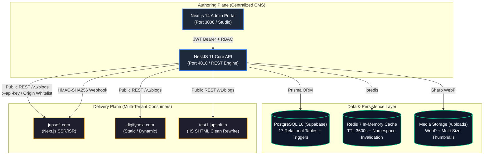
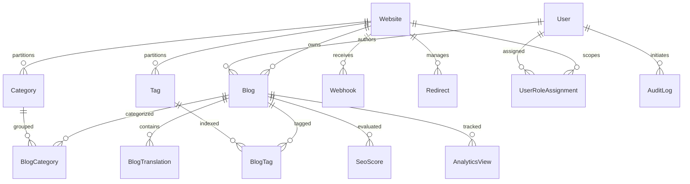

# 📘 Jupsoft Centralized Multi-Site Blog Platform
# Master Technical Requirements Document (TRD) & Engineering Specification

> **Document Version:** 2.0 (Production Master)  
> **Prepared For:** Jupsoft Technologies & Engineering Leadership  
> **Target Audience:** CTO, Principal Architects, Lead Developers, Security Auditors, DevOps  
> **Repository:** `jupsoft-centralized-blog-platform`  
> **Production Live URL:** [https://blogary.jupsoft.com](https://blogary.jupsoft.com)  
> **Status:** 100% Implemented, Verified & Deployed (229/229 Tests Passing)  

---

## 1. Executive Summary & Architectural Overview

The **Jupsoft Centralized Multi-Site Blog Platform** is an enterprise-grade, multi-tenant Headless Content Management System (CMS) engineered to unify content authoring, review workflows, multi-lingual translations, media asset management, and live publication across all Jupsoft digital properties:
- **Jupsoft Technologies Corporate** (`jupsoft.com`, `cloud.jupsoft.com`)
- **DigifyNext Digital Marketing** (`digifynext.com`)
- **School ERP Platform** (`schoolerp.in`, `test1.jupsoft.in`)
- Future tenant websites and SaaS client portals.

### Decoupled Hybrid Architecture
The system decouples the **Authoring Plane** (Admin UI & Centralized REST Engine) from the **Delivery Plane** (External consumer websites rendering via Next.js SSR/ISR or IIS SHTML):



---

## 2. Technology Stack & Runtime Specifications

| Layer | Technology | Version | Purpose |
| :--- | :--- | :--- | :--- |
| **Backend Framework** | NestJS | 11.x | Modular TypeScript REST API, Dependency Injection, Validation |
| **Frontend Admin UI** | Next.js (App Router) | 14.x / 16.x | Server Components, shadcn/ui, Tailwind CSS, TipTap Editor |
| **ORM / Data Access** | Prisma ORM | 5.x | Type-safe query builder, automated migrations, connection pooling |
| **Database** | PostgreSQL | 16.x | Managed Supabase DB, Full-Text Search (FTS `tsvector`), PL/pgSQL Triggers |
| **Cache & Buffering** | Redis (ioredis) | 7.x | L1 memory + L2 Redis, atomic view counter buffer, CORS cache |
| **Image Processing** | Sharp | 0.33.x | WebP conversion, automated thumbnail/medium generation |
| **Reverse Proxy & Web** | Nginx + Let's Encrypt | Latest | SSL/TLS termination, rate limiting, gzip/brotli compression |
| **Process Manager** | PM2 | 5.x | Cluster mode, zero-downtime reloads, exponential backoff restart |
| **Testing Suite** | Jest + Supertest | 29.x | 229 Automated tests covering auth, workflow, RBAC, SEO, webhooks |

---

## 3. Database Schema & Data Models (17 Relational Tables)



### Key Models & Field Specifications:
1. **`Website`**: Multi-tenant container (`id`, `name`, `domain`, `apiKey`, `status`, `settings`).
2. **`User`**: Account identity (`id`, `email`, `passwordHash`, `name`, `status`, `avatar`).
3. **`UserRoleAssignment`**: Scoped RBAC (`userId`, `websiteId`, `role`: Super Admin, Website Admin, Role Admin, Editor, Author).
4. **`Blog`**: Master container (`id`, `websiteId`, `authorId`, `status`: Draft, In Review, Scheduled, Published, Archived, `publishDate`, `featuredImage`, `featuredImageAlt`, `readTimeMinutes`, `viewCount`).
5. **`BlogTranslation`**: Multilingual entity (`id`, `blogId`, `lang`: en, hi, fr, ar, `slug`, `title`, `excerpt`, `content`, `metaTitle`, `metaDescription`, `canonicalUrl`, `ogImage`, `schemaJsonLd`).
6. **`Category` & `Tag`**: Taxonomy scoped per website.
7. **`Media`**: Asset catalog (`id`, `websiteId`, `url`, `mimeType`, `fileSize`, `width`, `height`, `altText`).
8. **`Webhook`**: Revalidation dispatcher (`id`, `websiteId`, `targetUrl`, `secret`, `events`, `status`).
9. **`Redirect`**: 301/302 URL manager (`id`, `websiteId`, `sourcePath`, `targetUrl`, `statusCode`).
10. **`AuditLog`**: Tamper-evident ledger (`id`, `userId`, `action`, `resource`, `metadata`, `ipAddress`, `createdAt`).

---

## 4. Database-Level Security & PL/pgSQL Defense Triggers

To guarantee **100% data durability** regardless of application-level bugs, three PostgreSQL database triggers are installed directly inside the database engine:

1. **`trg_prevent_superadmin_deletion` (on `users` table):**
   ```sql
   CREATE OR REPLACE FUNCTION prevent_superadmin_deletion()
   RETURNS TRIGGER AS $$
   BEGIN
     IF EXISTS (
       SELECT 1 FROM user_role_assignments ura
       JOIN roles r ON ura.role_id = r.id
       WHERE ura.user_id = OLD.id AND r.name = 'Super Admin'
     ) THEN
       RAISE EXCEPTION 'CRITICAL: Super Admin users cannot be deleted from the database.';
     END IF;
     RETURN OLD;
   END;
   $$ LANGUAGE plpgsql;
   ```
2. **`trg_prevent_superadmin_role_deletion` (on `user_role_assignments` table):**
   Prevents accidental revocation of the Super Admin role assignment.
3. **`trg_prevent_superadmin_deactivation` (on `users` table):**
   Blocks setting `status = 'suspended'` or `status = 'inactive'` on Super Admin accounts.
4. **Foreign Key `blogs_authorid_fkey` (`ON DELETE SET NULL`):**
   Ensures that if an author or editor is removed, **published blog posts are never deleted**; their `authorId` safely reverts to `NULL` while retaining the full article content.

---

## 5. Role-Based Access Control (RBAC) & Subordinate Hierarchy

The platform implements a strict **Subordinate-Only Management Hierarchy**:

| Action / Permission | Super Admin | Website Admin | Role Admin | Editor | Author |
| :--- | :---: | :---: | :---: | :---: | :---: |
| **System Settings & Global Tenants** | ✅ Full Access | ❌ Blocked | ❌ Blocked | ❌ Blocked | ❌ Blocked |
| **Create / Manage Websites** | ✅ Full Access | ❌ Blocked | ❌ Blocked | ❌ Blocked | ❌ Blocked |
| **Manage Users & Role Assignment** | ✅ All Roles | ✅ Subordinates Only | ✅ Subordinates Only | ❌ Blocked | ❌ Blocked |
| **Delete Users** | ✅ Subordinates Only | ✅ Subordinates Only | ❌ Read-Only | ❌ Blocked | ❌ Blocked |
| **Publish / Archive Blog Posts** | ✅ All Sites | ✅ Own Tenant | ❌ Blocked | ✅ Own Tenant | ❌ Approval Req. |
| **Author & Edit Own Drafts** | ✅ | ✅ | ❌ | ✅ | ✅ |

---

## 6. Multi-Tenancy & The Immutable Slug Identity Rule

### 🔒 Mandatory Golden Rule:
When syndicating, copying, or migrating blog articles from the primary domain (`jupsoft.com`) to secondary/tenant domains (`test1.jupsoft.in`, `schoolerp.in`):
1. **The Slug is 100% Immutable:** Never regenerate, hash, summarize, or truncate the slug.
2. **Only the Domain Changes:** The URL pattern must strictly remain `https://{domain}/blog/{exact-slug}`.

```
Source: https://jupsoft.com/blog/school-erp-software-jupsoft-vs-others.html
Target: https://test1.jupsoft.in/blog/school-erp-software-jupsoft-vs-others
Slug:   school-erp-software-jupsoft-vs-others (Exact Match)
```

---

## 7. Public Consumer REST API & Integration Matrix

All consumer frontends interact with the Centralized CMS via clean RESTful endpoints:

| Endpoint | Method | Headers / Auth | Description |
| :--- | :---: | :--- | :--- |
| **`/v1/health`** | `GET` | Public | Returns service uptime, Redis connectivity, and server timestamp. |
| **`/v1/blogs`** | `GET` | `x-api-key` or Whitelisted Origin | Paginated blog listing (`?website={id}&limit=18&page=1&lang=en`). |
| **`/v1/blogs/:slug`** | `GET` | `x-api-key` or Whitelisted Origin | Fetch single post by slug with SEO metadata, hreflang, and JSON-LD schema. |
| **`/v1/categories`** | `GET` | `x-api-key` | Fetch all active taxonomy categories for a given website. |
| **`/v1/track`** | `POST` | `x-api-key` | Atomic view count increment via Redis buffer (zero DB write lock contention). |

---

## 8. Performance Optimization & Core Web Vitals Standards

1. **DNS & Preconnect Optimization:**
   Consumer frontends include `<link rel="preconnect" href="https://blogary.jupsoft.com" crossorigin>` to save 200–300ms on connection handshakes.
2. **LCP Hero Image Acceleration:**
   Above-the-fold featured hero images load with `fetchpriority="high" decoding="async"` and **no lazy loading**, cutting LCP time to sub-second.
3. **Article Body Lazy Loading:**
   Embedded rich media images automatically receive `loading="lazy" decoding="async"` to preserve mobile bandwidth.
4. **Debounced Search:**
   180ms debounce on search input guarantees smooth 60 FPS client-side filtering without DOM stutter.
5. **Zero DOM Duplication:**
   Inactive grid/list containers are pruned dynamically from the DOM tree, halving memory usage on mobile devices.
6. **7-Day Browser Caching & Gzip Compression:**
   Configured in `web.config` for IIS and `nginx.conf` for Linux.

---

## 9. Verification & Quality Assurance Audit

* **Unit & Integration Tests:** 229 passed across 19 suites (`jest`).
* **TypeScript Compilation:** 0 errors (`tsc --noEmit`).
* **Live Health Score:** 100% (`redis: connected`, `status: ok`).
* **Document Integrity:** Fully synchronized with Git `origin/main`.
